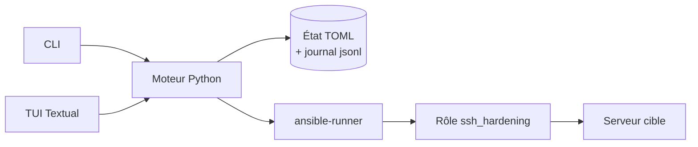
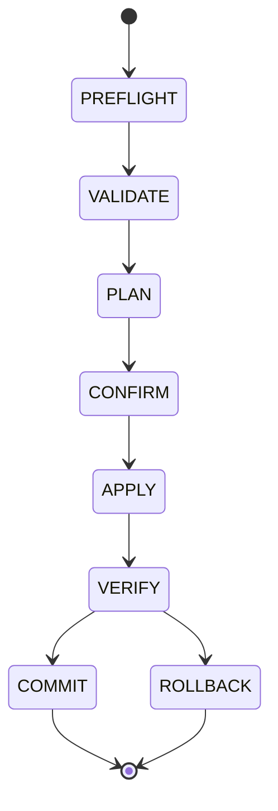
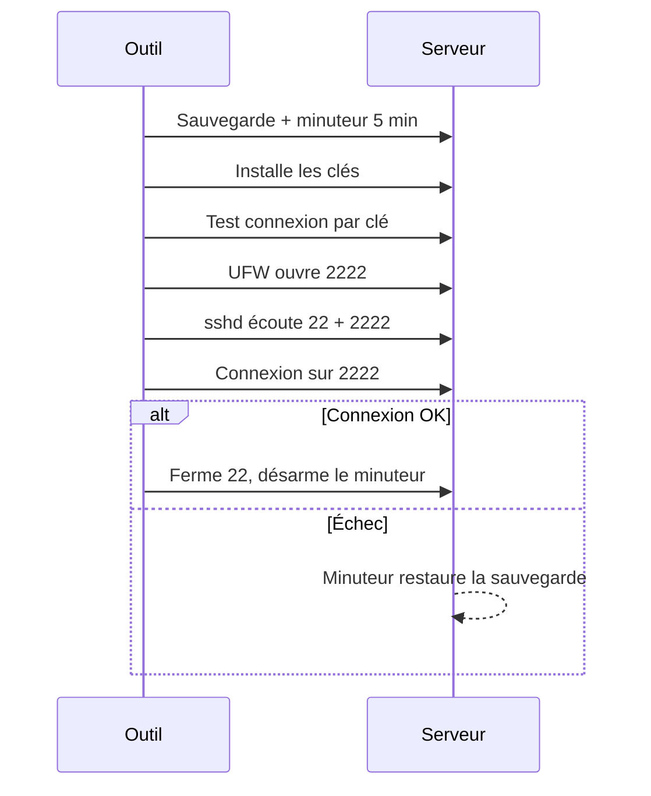

# ADR-001 — vps-secure : configuration 100 % interactive (CLI/TUI)

2026-09-19 · @Someone

## Statut et résumé

**Statut : Proposé.** vps-secure se configure désormais uniquement par un CLI puis un TUI interactif. Plus aucun fichier YAML n'est édité à la main.

Un moteur Python unique pilote Ansible via `ansible-runner`, garde son état en fichiers TOML et génère l'inventaire et les variables à la volée. Le CLI arrive en premier ; le TUI n'est ensuite qu'une vue sur le même moteur.

L'apply suit un protocole de sécurité (double port, vérification externe, minuteur de retour arrière) pour ne jamais se verrouiller hors d'un serveur.

## Contexte

L'outil actuel oblige à éditer `hosts.yml` et `group_vars/all.yml`, avec des règles implicites que rien ne vérifie. Une erreur (port, clé oubliée, `allow_users` vide) peut verrouiller l'utilisateur hors du serveur.

Le besoin : configurer des serveurs distants ou la machine locale sans jamais toucher au YAML, avec des paramètres optionnels et des jeux de paramètres réutilisables.

**Objectifs**

- Configuration exclusivement interactive, avec un mode non interactif pour le CI.
- Aucun état d'échec qui laisse un serveur inaccessible sans issue de secours.
- Chaque valeur appliquée est explicable (d'où vient-elle ?).

**Non-objectifs**

- Gérer d'autres systèmes que Ubuntu (pour l'instant).
- Remplacer Ansible : le rôle `ssh_hardening` reste le moteur d'exécution.
- Gérer les pare-feu cloud (security groups) : seulement les détecter et avertir.

## Décision

Un moteur sans interface porte toute la logique ; le CLI et le TUI ne sont que deux façons de l'appeler.

Le moteur lit et écrit l'état, valide, puis lance Ansible. Le TUI est construit après le CLI, sans dupliquer de logique.

| Sujet | Décision |
| --- | --- |
| Langage | Python, déjà requis par Ansible |
| Pilotage d'Ansible | `ansible-runner` : événements structurés, pas de parsing de texte |
| État | Un fichier TOML par entité dans `~/.config/vpssecure/`, plus un journal `jsonl` en ajout seul |
| YAML | Généré dans un dossier temporaire à chaque run, puis supprimé |
| Rôle Ansible | Inchangé ; variables passées par `-e @fichier` au lieu de `group_vars` |
| Ordre de livraison | Moteur, CLI, protocole d'apply, profils, puis TUI |
| Automatisation | Sous-commandes scriptables qui lisent le même état |

## Modèle de données et statuts

Quatre entités, chacune dans son fichier, pour que modifier un serveur ne modifie jamais un profil.

| Entité | Contenu |
| --- | --- |
| Server | Nom, type (`local` ou `remote`), hôte, utilisateur, port de connexion, chemin de la clé d'identité, empreinte de la clé d'hôte |
| Profile | Paramètres de durcissement, à plat, sans héritage |
| Key | Clé publique nommée, réutilisable, avec un indicateur « clé privée détenue localement » |
| Run | Journal d'une exécution : phases et résultat |

Trois couches sont distinguées : le **voulu** (profil plus surcharges), l'**appliqué** (hash du dernier apply) et l'**observé** (le serveur réel). Le serveur reste la source de vérité.

Le statut d'un serveur est **dérivé à l'affichage**, jamais stocké. On ne conserve que la dernière observation (avec sa date) et le hash de la dernière configuration appliquée.

| Statut | Condition |
| --- | --- |
| `unknown` | Jamais scanné |
| `compliant` | Observé égal au voulu |
| `pending` | Le profil a changé depuis le dernier apply |
| `drifted` | Observé différent du voulu |
| `unreachable` | Injoignable au dernier contact |
| `unresolved` | Un run inachevé existe |

Un run suit cette machine d'états. Le journal est écrit **avant** chaque phase pour survivre à un crash.

Issues possibles : `SUCCESS`, `NOOP`, `ABORTED`, `BLOCKED`, `ROLLED_BACK`, et `INCONSISTENT` quand le retour arrière lui-même échoue.

## Modèle de paramètres

La notion d'« optionnel » existe à deux niveaux seulement, et pas au-delà.

- **Niveau module** : SSH est toujours géré. UFW et Fail2ban sont `géré` ou `non géré` (l'outil n'y touche pas). « Non géré » ne défait rien de ce qui a été appliqué avant ; pour cela, une action `revert` explicite supprime les règles et le drop-in.
- **Niveau paramètre** : deux états seulement, `hérité` (valeur par défaut) ou `valeur`. Il n'y a pas de « désactivé » par paramètre.
- **Listes** : `[]` n'est valide que là où il a un sens. Pour `allow_users` et `allow_groups`, il est interdit.

**Priorité de fusion**, de la plus faible à la plus forte : défauts du rôle, profil, surcharge du serveur, options de la ligne de commande. Les profils n'héritent pas les uns des autres, pour éviter les chaînes illisibles.

En contrepartie, chaque valeur affiche sa **provenance**, comme `git config --show-origin` : par exemple `2222 ← profil:prod`.

Chaque paramètre est déclaré une seule fois avec son type, son défaut, son niveau de risque (sûr, risqué, dangereux), ses dépendances et ses validateurs. Le CLI et le TUI génèrent leurs formulaires à partir de cette déclaration, ce qui évite de coder chaque écran deux fois.

| Dépendance | Effet |
| --- | --- |
| Le port SSH change | UFW ouvre le nouveau port avant sshd ; Fail2ban surveille ce port |
| Mot de passe désactivé | Une clé doit avoir été testée par une vraie connexion |
| Fail2ban géré | L'IP de l'opérateur est proposée en liste blanche |

## Règles de validation

La validation se fait dans l'outil, avant tout appel à Ansible. Une règle **BLOCK** empêche l'apply ; une règle **WARN** demande une confirmation explicite.

| Règle | Niveau |
| --- | --- |
| Aucune clé vérifiée (clé privée détenue localement et testée) | BLOCK |
| L'utilisateur de connexion n'est pas dans `allow_users` ou `allow_groups` | BLOCK |
| `allow_users` et `allow_groups` tous deux vides | BLOCK |
| Port déjà utilisé par un autre service | BLOCK |
| OS non supporté, ou `sudo` inutilisable | BLOCK |
| Empreinte de clé d'hôte changée | BLOCK |
| IP de l'opérateur absente de la liste blanche Fail2ban | WARN, correction proposée |
| Pare-feu cloud (security group AWS ou Azure) non vérifiable | WARN |
| Mode `local` exécuté au travers d'une session SSH | WARN |
| Ports publiés par Docker, qui contournent UFW | WARN |

Un BLOCK ne se contourne qu'avec un flag nommé et explicite pour cette règle, jamais avec un simple `--yes`.

## Protocole d'apply sûr

Ouvrir UFW avant de redémarrer sshd ne suffit pas. L'apply garde l'ancien accès ouvert jusqu'à ce qu'une nouvelle connexion réelle ait réussi depuis le poste de contrôle.

1. **Préflight** : connexion, OS, version de sshd, configuration effective (`sshd -T`), ports en écoute, IP de l'opérateur vue du serveur.
2. **Sauvegarde** de la configuration existante.
3. **Minuteur de retour arrière** côté serveur (`systemd-run --on-active=5min`) qui restaure la sauvegarde. Il couvre un crash de l'outil ou une coupure réseau.
4. **Clés** installées, puis test réel d'une connexion par clé (`BatchMode`) avant toute désactivation du mot de passe.
5. **UFW** : ouverture du nouveau port, l'ancien restant ouvert.
6. **sshd en double port** (par exemple 22 et 2222) via un drop-in nommé `00-vpssecure.conf`, validé par `sshd -t`, puis `reload`.
7. **Vérification externe** : nouvelle connexion sur le nouveau port depuis le poste de contrôle. Un échec déclenche le retour arrière ; c'est le seul moyen de détecter un pare-feu cloud fermé.
8. **Finalisation** : retrait de l'ancien port dans sshd et UFW, revérification, désarmement du minuteur.

Le drop-in s'appelle `00-` pour passer avant `50-cloud-init.conf` : sshd retient la **première** valeur rencontrée, et cloud-init réactive souvent `PasswordAuthentication yes`. Le retour arrière se réduit alors à supprimer ce fichier.

## Réactions du CLI et du TUI

Chaque situation a une réaction définie dans les trois modes. Sans terminal interactif, l'outil ne pose jamais de question : il échoue proprement avec un code de sortie.

| Situation | CLI interactif | TUI | Non interactif (CI) |
| --- | --- | --- | --- |
| Champ obligatoire manquant | Pose la question | Champ surligné, « Appliquer » grisé | Code 2 + liste des champs |
| Règle BLOCK | Explique la correction, refuse | Panneau rouge | Code 2 |
| Règle WARN | Confirmation (défaut : non) | Case à cocher | Refus sauf `--accept-warning=<id>` |
| Hôte injoignable | Propose de réessayer, pistes (port, pare-feu) | Statut rouge + détail | Code 3 |
| Clé d'hôte inconnue | Affiche l'empreinte, demande | Modale | Échec sauf empreinte pré-enregistrée |
| Clé d'hôte changée | BLOCK avec explication | BLOCK | Code 4 |
| Authentification refusée | Nouveau prompt masqué, 3 essais max | Modale masquée | Code 4 |
| Vérification externe échoue | Retour arrière auto + cause probable | Retour arrière en direct | Code 6 |
| Retour arrière échoue | Commande de récupération exacte | Bandeau rouge | Code 7 |
| Ctrl-C pendant l'apply | 1er : finit l'étape puis retour arrière ; 2e : arrêt, minuteur reste armé | Idem (`q`) | Code 130 |
| Crash ou coupure réseau | Au lancement suivant : run inachevé détecté, propose vérifier ou annuler | Idem | `status` renvoie 7 |
| Dérive détectée | Tableau attendu/observé, réappliquer ou adopter | Vue diff | `scan` renvoie 5 |
| Déjà conforme | « Rien à faire » | Idem | Code 0 |
| Run concurrent | Verrou par serveur, refuse | Idem | Code 8 |

Deux règles transversales. Les assistants de saisie sont **transactionnels** : rien n'est écrit tant que l'utilisateur n'a pas validé. Le mot de passe SSH ou sudo n'est demandé qu'en prompt masqué et n'est jamais stocké.

## Alternatives envisagées

| Alternative | Rejetée parce que |
| --- | --- |
| Garder le YAML comme interface principale | C'est précisément le problème à résoudre : erreurs silencieuses et règles implicites |
| Bash + gum ou dialog | Léger, mais fragile dès que l'état, la validation et les statuts deviennent complexes |
| Go + Bubble Tea | Binaire unique agréable, mais il faudrait appeler `ansible-playbook` en sous-processus et parser du texte |
| État en SQLite | Peu lisible et difficile à diffuser ; des fichiers TOML se relisent, se versionnent et se réparent à la main |
| Statut stocké dans l'état | Devient faux dès que le serveur change hors de l'outil ; un statut dérivé ne peut pas mentir |
| Héritage entre profils | Chaînes difficiles à raisonner ; la provenance affichée apporte la traçabilité sans l'héritage |
| Se fier à `ansible --check` comme plan | Se trompe quand une tâche dépend d'une tâche précédente ; le plan vient de la comparaison voulu/observé, `--check --diff` servant de second avis |
| TUI plein écran dès le départ | Double le travail avant d'avoir un protocole d'apply éprouvé ; le CLI d'abord |

## Conséquences

**Positives**

- Plus de configuration par YAML : les erreurs de saisie sont détectées avant Ansible.
- Un serveur ne peut plus être verrouillé par un oubli de clé ou de `allow_users`.
- Chaque valeur est traçable grâce à la provenance, et chaque run est rejouable depuis le journal.
- Le CLI, le TUI et le CI partagent le même moteur et les mêmes règles.

**Négatives**

- Le protocole d'apply multiplie les cas à tester ; il faut des VM jetables (Multipass ou Vagrant) pour simuler chaque échec.
- Le mode `local` reste le plus risqué : sans vérification externe possible, le minuteur est la seule protection.
- Le projet passe de Bash à Python : réécriture de la CLI actuelle et nouvelle dépendance à `ansible-runner`.

**Neutres**

- Le rôle `ssh_hardening` est inchangé ; seul le canal des variables change.
- Les inventaires `inventories/<env>/` existants ne sont plus la source de vérité et devront être importés une fois.

## Risques, points à vérifier et plan

Plusieurs hypothèses de ce document n'ont pas encore été vérifiées. Elles doivent l'être avant de figer le protocole d'apply.

| Point à vérifier | Pourquoi |
| --- | --- |
| Comportement de `ssh.socket` sur Ubuntu 22.10 et plus | Un changement de `Port` dans `sshd_config` peut être ignoré ; à tester sur 22.04 et 24.04 |
| Tâches actuelles du rôle `ssh_hardening` | Le plan suppose l'ordre des tâches sans l'avoir relu dans `roles/ssh_hardening/` |
| Priorité des drop-ins sshd avec cloud-init | Le nom `00-vpssecure.conf` repose sur la règle « première valeur gagne » |
| Mode `local` sans vérification externe | Seul le minuteur protège ; à tester sur VM avec coupure simulée |
| UFW et Docker | Les ports publiés par Docker contournent UFW ; à documenter et avertir |

**Plan de construction**

1. **Moteur** : modèle de paramètres, validation, scan, journal d'exécution.
2. **`harden`** avec le protocole complet, testé sur VM pour chaque scénario d'échec.
3. **Profils, clés, provenance** et statuts dérivés.
4. **TUI Textual**, comme vue sur le moteur existant.

**Questions ouvertes**

- Migrer ou abandonner les inventaires `inventories/<env>/` existants ?
- Faut-il un chiffrement de l'état au repos, ou les permissions `600` suffisent-elles ?
